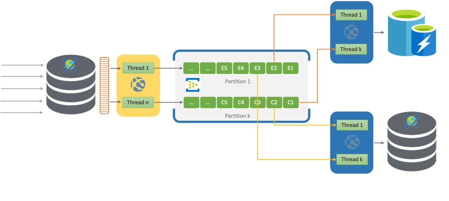

# CosmosChangeFeed
This demo application showcases how to implement Change data capture using Cosmos Change Feed.

This is a 'Streaming ETL' application with Cosmos SQL API DB being source with 
 Cosmos Mongo DB and Azure cache for Redis as Targets.

Azure event hub acts as a persistent stream to receive events from source and targets consumes events from event hub.

There are primarily 3 apps + 1 utility app, 
1. Reader App - Application which implements CDC to read changes from Cosmos SQL API DB in realtime using multiple threads (one per logical partition) and pushes to Event hub.
2. Writer App - Application reads the change events from Azure event hub using multiple threads (one per partition in Event hub) and writes it to Cosmos Mongo API DB
3. Cache App - Application reads the changes events from Azure event hub using multiple threads (one per partition in Event hub) and writes it to Azure cache for Redis
4. Utility App - Console Application to insert one auto generated item into source Cosmos SQL API DB on hitting enter key

To compile individual application, cd to respective folder and do 'mvn clean install' and then run.

ps: Replace 'ToBeFilled' in main method of all 4 application with necessary host, connection url and keys before compiling.

